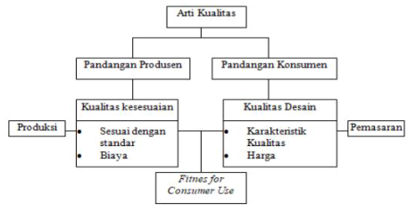

```{r setup, include=FALSE}
knitr::opts_chunk$set(echo = FALSE)
```

## PENDAHULUAN
*Beauty is in the eye of the beholder*. Kualitas merupakan penilaian yang bersifat subyektif dari setiap orang. Kualitas secara singkat dapat diartikan penilaian terhadap apa yang didapatkan dari apa yang telah dibayarkan. Dalam modul 4 ini, Anda akan mempelajari bagaimana mengelola kualitas produk, layanan, proses produksi dan proses layanan. Setelah mempelajari modul ini Anda diharapkan mampu:

- [x] menjelaskan konsep kualitas dan manajemen kualitas
- [x] menjelaskan alat dan teknik perbaikan kualitas
- [x] menjelaskan pengertian, manfaat dan jenis standar internasional
- [x] menjelaskan konsep *total quality management*
- [x] menjelaskan pengertian pengendalian kualitas statistik
- [x] menjelaskan teknik pengendalian kualitas proses statistik untuk data variabel
- [x] menjelaskan teknik pengendalian kualitas proses statistik untuk data atribut
- [x] menjelaskan pengertian dan cara melakukan analisis kemampuan proses

---

## KEGIATAN BELAJAR 1: Manajemen Kualitas dan Standar Internasional
### A. KONSEP KUALITAS DAN MANAJEMEN KUALITAS

- Keseluruhan ciri atau karakteristik produk atau jasa dalam tujuannya untuk memenuhi kebutuhan dan harapan pelanggan

- Kualitas produk atau jasa dapat diwujudkan bila orientasi seluruh kegiatan perusahaan diarahkan pada pencapaian kepuasan konsumen




---

### B. ALAT DAN TEKNIK PERBAIKAN KUALITAS

1. Diagram Pareto
2. Histogram
3. Lembar Pengecekan
4. Analisis Matriks
5. Diagram Sebab Akibat
6. Diagram Penyebaran
7. Diagram Alur
8. Run Chart
9. Time Series
10. Steam and Leaf Plots
11. Box Plots
12. Peta Multivariabel
13. Peta Pengendali

### C. STANDAR INTERNASIONAL

- ISO 9000 salah satu penjaminan mutu yang banyak digunakan
- ISO 9000 merujuk pada seperangkat standar yang meliputi: ISO 9000, ISO 9001, ISO 9002, ISO 9003 dan ISO 9004
- Standar tersebut mencakup perancangan kualitas, manajemen kualitas, dan penjaminan kualitas

#### ISO 9000

- Standar manajemen kualitas dan penjaminan kualitas
- Pemandu untuk pemilihan dan penggunaan standar
- Standar ISO 9000 berisi pedoman yang digunakan bersamaan dengan keempat standar lainnya.

#### ISO 9001

- Sistem kualitas - mengarah pada efektivitas
- Model untuk penjaminan kualitas dalam perancangan/pengembangan, produksi, instalasi dan pelayanan jasa
- Menjamin ketaatan terhadap kualitas dalam tahap perancangan/pengembangan, produksi, instalasi dan pelayanan jasa.
- Dipakai oleh berbagai jenis perusahaan

#### ISO 9002

- Model untuk penjaminan mutu untuk produksi dan instalasi
- Lebih lunak daripada ISO 9001
- Biasa digunakan perusahaan manufaktur

#### ISO 9003

- Model penjaminan kualitas dalam inspeksi akhir dan pengujian
- Sangat terbatas dan sedikit digunakan


#### ISO 9004

- Berisi pemandu dalam hal-hal yang berkaitan dengan faktor teknis, administratif dan sumber daya manusia yang mempengaruhi kualitas produk dan jasa. 
- Pemandu dalam pengembangan dan implementasi sistem kualitas

### D. TOTAL QUALITY MANAJEMEN

- Faktor kunci dalam produktivitas, efektivitas, efisiensi dan peningkatan kepuasan pelanggan dan karyawan
- Filosofi yang bertujuan perbaikan terus-menerus dan berkelanjutan
- Visi yang berfokus setiap orang dalam organisasi berkontribusi terhadap perbaikan kualitas
- Penekanan utama pada kualitas, dengan mengerjakan sesuatu dengan baik sejak dari awal untuk memenuhi kepuasan pelanggan.

---

## KEGIATAN BELAJAR 2: Pengendalian Kualitas Statistik
### A. PENGERTIAN PENGENDALIAN KUALITAS STATISTIK

- Teknik penyelesaian masalah yang digunakan untuk memonitor, mengendalikan, menganalisis, mengelola serta memperbaiki produk dan proses menggunakan metode-metode statistik.

### B. PENGENDALIAN KUALITAS PROSES STATISTIK UNTUK DATA VARIABEL
- Peta Pengendalian (*control chart*):
  + Pemilihan karakteristik kualitas
  + Pemilihan subkelompok
  + Pengumpulan data
  + Penentuan garis pusat
  + Penyusunan revisi terhadap garis pusat
  + Interpretasi terhadap pencapaian tujuan

### C. PENGENDALIAN KUALITAS PROSES STATISTIK UNTUK DATA ATRIBUT

- Atribut: karakteristik kualitas yang sesuai dengan spesifikasi atau tidak sesuai dengan spesifikasi

### D. ANALISIS KEMAMPUAN PROSES

- Tahapan yang harus dilakukan dalam mengadakan pengendalian kualitas proses statistik
- Merupakan kemampuan proses untuk memenuhi spesifikasi yang didesain menurut pendesain perusahaan atau permintaan pelanggan.

