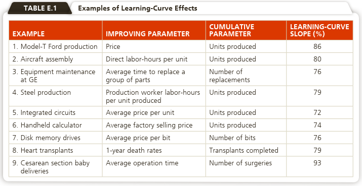

```{r setup, include=FALSE}
knitr::opts_chunk$set(echo = FALSE)
```

## PENDAHULUAN

Beberapa ahli berpandangan bahwa sumber daya manusia lebih penting dibandingkan sumber daya lain dalam memenangkan persaingan. Kemajuan teknologi informasi dan komunikasi yang membawa perubahan lingkungan kerja membutuhkan karyawan yang ahli secara teknis dan dapat berkomunikasi secara efektif dengan pelanggan. Produktivitas, efisiensi dan efektivitas sebagai salah satu tujuan perusahaan banyak terkait dengan sumber daya manusia. Oleh karena itu penting bagi perusahaan untuk melakukan perencanaan dan pengelolaan SDMnya dengan baik.

Pada modul ini, Anda akan mempelajari pengelolaan SDM, bagaimana membuat desain kerja dan bagaimana melakukan pengukuran kinerja. Secara umum setelah mempelajari modul ini, mahasiswa diharapkan dapat menjelaskan desain kerja dan pengukuran kinerja karyawan serta menjelaskan penggunaan kurva pembelajaran yang mendukung desain kerja dan pengukuran kinerja.

Secara khusus, setelah mempelajari modul ini, mahasiswa diharapkan mampu menjelaskan:

- [x] pengertian manajemen sumber daya manusia dalam organisasi;
- [x] praktik pengelolaan SDM;
- [x] desain kerja;
- [x] desain kerja dan cara memotivasi karyawan untuk bekerja;
- [x] kurva pembelajaran dalam layanan dan manufaktur;
- [x] beberapa pendekatan dalam kurva pembelajaran;
- [x] pengukuran waktu kerja karyawan;
- [x] ergonomi dan lingkungan kerja karyawan.

## KEGIATAN BELAJAR 1: STRATEGI PENGELOLAAN SDM OPERASIONAL

### MANAJEMEN SDM (MSDM)

- Semua kegiatan dalam organisasi yang mencakup penggabungan dan penggunaan SDM.
- MSDM yang baik harus memenuhi hak dan kewajiban karyawan dan permintaan masyarakat
- Departemen MSDM bertanggung jawab dalam hal-hal teknis dan manajerial yang berhubungan dengan SDM.
- Pengembangan sistem SDM merupakan *invisble asset* yang melekat dalam sistem operasi organisasi.
- Praktik pengelolaan SDM meliputi perencanaan karyawan, penyusunan jadwal kerja, desain pekerjaan, penentuan waktu kerja serta evaluasi kinerja karyawan

<br />

### DESAIN PEKERJAAN

- Job design specifies the tasks that constitute a job for an individual or a group. 
- Five components of job design: 
  +  job specialization, 
  +  job expansion, 
  +  psychological components, 
  +  self-directed teams, and 
  +  motivation and incentive systems.

- Beberapa Atribut Penting dalam Desain Pekerjaan:

  + Tingkat pengulangan yang tepat
  + Tingkat perhatian dan penyerapan yang tepat
  + Tanggung jawab karyawan untuk mengambil keputusan dan kebijakan
  + Pengendalian karyawan terhadap pekerjaannya
  + Sasaran dan umpan balik pencapaian
  + Kontribusi terhadap produk atau jasa yang berguna
  + Kesempatan menjalin hubungan dan pertemanan personal
  + Beberapa pengaruh melalui cara kerha yang dilaksanakan dalam kelompok
  + Penggunaan keahlian

- Job enlargement: the grouping of a variety of tasks
about the same skill level; horizon-
tal enlargement.

- Job rotation: a system in which an employee is
moved from one specialized job to
another.

- Job enrichment: a method of giving an employee
more responsibility that includes some of the planning and control
necessary for job accomplishment; vertical expansion.

- Employee empowerment: enlarging employee jobs so that
the added responsibility and
authority are moved to the lowest
level possible.


`Sumber: Heizer, et.al (2020)`


## KEGIATAN BELAJAR 2: KURVA PEMBELAJARAN DAN PENGUKURAN KERJA

- Learning curves are based on the premise that people and organizations become better at
their tasks as the tasks are repeated.
- A learning curve graph (see Figure) displays cost (or time) per unit versus the cumulative number of units produced. 
- From it we see that the time needed to produce a unit decreases, usually following a negative exponential curve (part a), as the person or company produces more units.
  + It takes less time to complete each additional unit a firm produces. 
  + However, the time savings in completing each subsequent unit also decreases.
  
  
  `Sumber: Heizer, et.al (2020)`
  
  Prinsip ini ditunjukkan dengan rumus:
  $T * L^n = Time\ required\ for\ the\ nth\ unit$
  
  Dimana, 
  
  T = unit cost or unit time of the first unit
  
  L = learning curve rate
  
  n = number of times T is doubled

### KURVA PEMBELAJARAN DALAM LAYANAN DAN MANUFAKTUR

- Different organizations, different products have different learning curves. 
- The rate of learning varies depending on the quality of management and the potential of the process and product. 
- Any change in process, product, or personnel disrupts the learning curve.
- Thus,a learning curve does not seem smooth, continuing and permanent.


`Sumber: Heizer, et.al (2020)`

