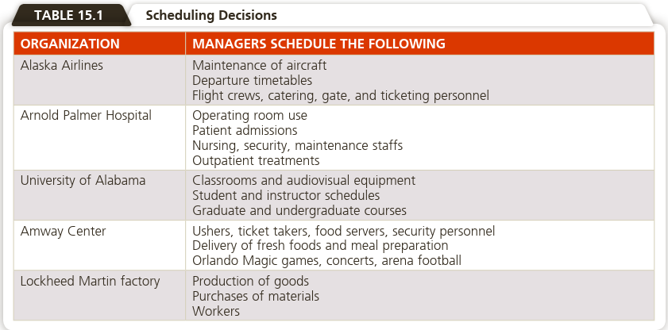
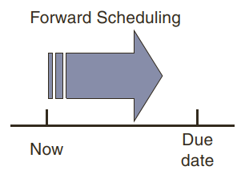
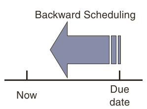
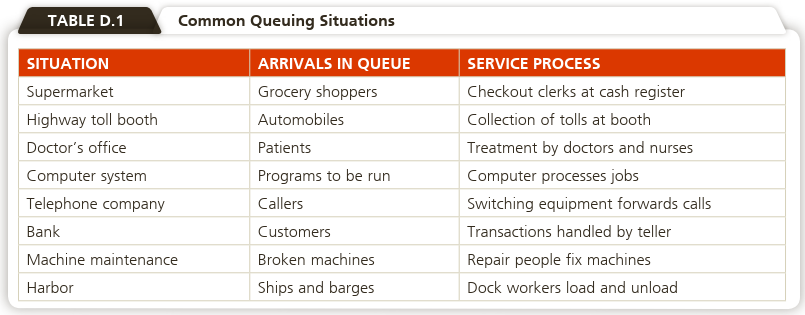
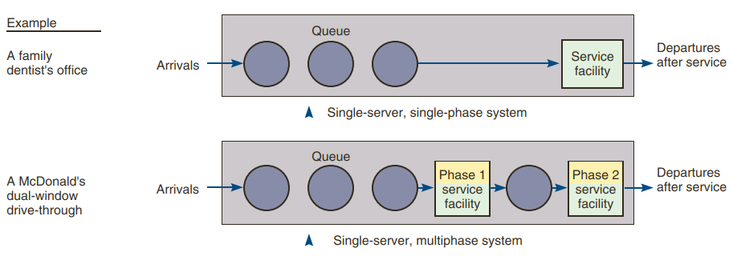
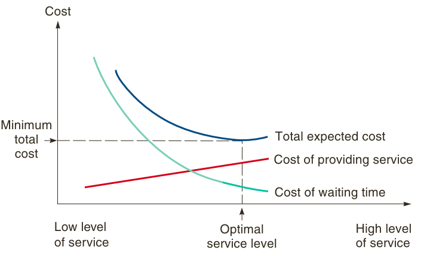

```{r setup, include=FALSE}
knitr::opts_chunk$set(
  echo = FALSE,
  R.options=list(width=60))
```

## PENDAHULUAN

Proses produksi memerlukan perencanaan dan penjadwalan proses secara terstruktur untuk menghindari *overload* dan *underload* baik yang dialami oleh karyawan maupun mesin-mesin yang digunakan dalam proses produksi.

Secara umum setelah mempelajari modul ini, mahasiswa diharapkan dapat menjelaskan pengertian perencanaan dan penjadwalan, perlunya dilakukan perencanaan dan penjadwalan produksi dan layanan, berbagai metode yang dapat digunakan dalam perencanaan dan penjadwalan produksi.

Secara khusus, setelah mempelajari modul ini, mahasiswa diharapkan mampu:

- [x] menjelaskan pengertian perencanaan dan penjadwalan produksi dan layanan.
- [x] menjelaskan proses perencanaan dan penjadwalan agregat
- [x] menjelaskan strategi perencanaan dan penjadwalan agregat
- [x] menjelaskan tujuan penjadwalan jangka pendek
- [x] menjelaskan metode yang digunakan dalam penugasan
- [x] menjelaskan penggunaan metode pengurutan
- [x] menjelaskan penjadwalan layanan
- [x] menjelaskan metode penjadwalan layanan
- [x] menjelaskan pengertian dan tujuan analisis teori antrean
- [x] menjelaskan model antrean.

## KEGIATAN BELAJAR 1: Perencanaan dan Penjadwalan Agregat

### Sifat Perencanaan Agregat

- The objective of aggregate planning is usually to meet forecast demand while minimizing cost over the planning period. 
- However, other strategic issues may be more important than low cost. 
- These strategies may be to smooth employment, to drive down inventory levels, or to meet a high level of service, regardless of cost.
- Examples:
  + An aggregate plan for BMW tells the auto manufacturer how many cars to make but not how many should be two-door vs. four-door or red vs. green. 
  + It tells Steel factory how many tons of steel to produce but does not differentiate grades of steel.

### Strategi-Strategi Perencanaan Agregat

Ketika merancang perencanaan agregat, manajer operasi harus menjawab beberapa pertanyaan berikut: 

1. Should inventories be used to absorb changes in demand during the planning period?
2. Should changes be accommodated by varying the size of the workforce?
3. Should part-timers be used, or should overtime and idle time absorb fluctuations?
4. Should subcontractors be used on fluctuating orders so a stable workforce can be
maintained?
5. Should prices or other factors be changed to influence demand?

### Opsi-Opsi Perencanaan Agregat


`Sumber: Heizer, et. al. (2020)`

## KEGIATAN BELAJAR 2: Penjadwalan Jangka Pendek

### Pentingnya Penjadwalan Jangka Pendek

#### Perhatikan Contoh-Contoh Berikut:

- Perusahaan penerbangan membuat penjadwalan yang melibatkan:

  + Ratusan pesawat setiap hari.
  + Ribuan pilot dan pramugari agar penumpang bisa sampai ke tujuannya tepat waktu.
  + Membuat penyesuaian yang cepat dengan perubahan permintaan, kondisi cuaca, dll. 

- Penjadwalan Perusahaan Manufaktur:

  + Match resources to customer demands, scheduling competence focuses on making parts on a just-in-time basis, with low setup times, little work-in-process, and high facility utilization. 
  + Efficient scheduling result in manufacturing companies drive down costs and meet promised due dates.
  
Jadi Peran Strategis Penjadwalan adalah:

- **Secara internal**: effective scheduling means faster movement of goods and services through a facility and greater use of assets. The result is greater capacity per money invested, which translates into lower costs.
- **Secara eksternal**: good scheduling provides faster throughput, added flexibility, and more dependable delivery, improving customer service.

### Permasalahan-Permasalahan Penjadwalan


`Sumber: Heizer, et. al. (2020)`

### Forward and Backward Scheduling

- Forward scheduling starts the schedule as soon as the job requirements are known. 
- Forward scheduling is used in organizations such as hospitals, clinics, restaurants, and machine tool manufacturers. 
- In these facilities, jobs are performed to customer order, and delivery is typically scheduled at the earliest possible date.

```{r out.width="31%"}

```


- Backward scheduling begins with the due date, scheduling the final operation first.
- Steps within the job are then scheduled, one at a time, in reverse order. 
- By subtracting the time needed for each item, the start time is obtained. 
- Backward scheduling is used in manufacturing environments, as well as service environments such as catering a banquet or scheduling surgery.

```{r out.width="31%"}

``` 


--> In practice, a combination of forward and backward scheduling is often used to find a reasonable trade-off between capacity constraints and customer expectations.

### Metode Pengurutan (Sequencing Jobs)

- Sequencing (often called dispatching) is accomplished by specifying the priority rules to use to release (dispatch) jobs to each work center.
- Priority rules are especially applicable for process-focused facilities such as clinics, print shops, and manufacturing job shops. 
- The most popular priority rules are:
  + **FCFS**: first come, first served. Jobs are completed in the order they arrived.
  + **SPT**: shortest processing time. Jobs with the shortest processing times are assigned first.
  + **EDD**: earliest due date. Earliest due date jobs are assigned first.
  + **LPT**: longest processing time. Jobs with the longest processing time are assigned first.

- No one sequencing rule always excels on all criteria:

  1. Shortest processing time (SPT) is generally the best technique for minimizing job flow and minimizing the average number of jobs in the system. Its chief disadvantage is that long-duration jobs may be continuously pushed back in priority in favour of short-duration jobs. Customers may view this dimly, and a periodic adjustment for longer jobs must be made.
  2. First come, first served (FCFS) does not score well on most criteria (but neither does it score particularly poorly). It has the advantage, however, of appearing fair to customers, which is important in service systems.
  3. Earliest due date (EDD) minimizes maximum tardiness, which may be necessary for jobs that have a very heavy penalty after a certain date. In general, EDD works well when lateness is an issue.
  
### Penjadwalan Layanan

Penjadwalan sistem layanan berbeda dari penjadwalan manufactur dalam beberapa aspek: 

- In manufacturing, the scheduling emphasis is on machines and materials; in services, it is on staffing levels.
- Inventories can help smooth demand for manufacturers, but many service systems do not maintain inventories.
- Services are labour intensive, and the demand for this labour can be highly variable.
- Legal considerations, such as wage and hour laws and union contracts that limit hours worked per shift, week, or month, constrain scheduling decisions.
- Because services usually schedule people (rather than material), social, fatigue, seniority, and status issues complicate scheduling.

### Contoh-Contoh Kompleksitas Penjadwalan Layanan

**Rumah Sakit**

A hospital is an example of a service facility that may use a scheduling system
every bit as complex as one found in a job shop. Hospitals seldom use a machine shop priority system such as first come, first served (FCFS) for treating emergency patients, but they often use FCFS within a priority class, a “triage” approach. And they often schedule products (such as surgeries) just like a factory, maintaining excess capacity to meet wide variations in demand.

**Bank**

Banks Cross-training of the workforce in a bank allows loan officers and other managers to provide short-term help for tellers if there is a surge in demand. Banks also employ parttime personnel to provide a variable capacity.

**Ritel**

Retail Stores Scheduling optimization systems, such as Workbrain, Cybershift, and
Kronos, are used at retailers including Walmart, Payless Shoes, and Target. These systems track individual store sales, transactions, units sold, and customer traffic in 15-minute increments to create work schedules. Walmart’s 2.3 million and Target’s 350,000 employees used to take thousands of managers’ hours to schedule; now staffing is drawn up nationwide in a few hours, and customer checkout experience has improved dramatically.

**Buka 24 jam/7 hari**

24/7 Operations Emergency hotlines, police/fire departments, telephone operations, and
mail-order businesses (such as L.L.Bean) schedule employees 24 hours a day, 7 days a week. To allow management flexibility in staffing, sometimes part-time workers can be employed. This provides both benefits (in using odd shift lengths or matching anticipated workloads) and difficulties (from the large number of possible alternatives in terms of days off, lunch hour times, rest periods, starting
times). Most companies use computerized scheduling systems to cope with these complexities.

**Penerbangan**


## Kegiatan Belajar 3: Teori Antrean (*Queuing Theory*)

- Queuing theory, is an important part of operations and a valuable tool for the operations manager.

- Mengantri adalah situasi yang umum terjadi:
  + mobil mau masuk/keluar jalan tol 
  + pasien di rumah sakit atau praktek dokter 
  + wisuda sarjana...hmm


`Sumber: Heizer, et. al. (2020)`

### Karakteristik Sistem Garis Tunggu

The three parts of a waiting-line, or queuing, system:

1. Arrivals or inputs to the system: These have characteristics such as population size, behaviour, and a statistical distribution.
2. Queue discipline, or the waiting line itself: Characteristics of the queue include whether it is limited or unlimited in length and the discipline of people or items in it.
3. The service facility: Its characteristics include its design and the statistical distribution of service times.

**Arrival Characteristics**

The input source that generates arrivals or customers for a service system has three majorcharacteristics:

 1. Size of the arrival population
 2. Behavior of arrivals
 3. Pattern of arrivals (statistical distribution)
 
**Waiting-Line Characteristics**

- The length of a line can be either limited or unlimited. 
- A queue is limited when it cannot, either by law or because of 
physical restrictions, increase to an infinite length. 
- A small barbershop, for example, will have 
only a limited number of waiting chairs. 
- A queue is unlimited when its size is unrestricted, as in the case of the toll booth serving arriving automobiles.

- A second waiting-line characteristic deals with queue discipline. 
- This refers to the rule by which customers in the line are to receive service. Most systems use a queue discipline known as the first-in, first-out (FIFO) rule. 
- In a hospital emergency room or an express checkout line at a 
supermarket, however, various assigned priorities may preempt FIFO. 
- Patients who are critically injured will move ahead in treatment priority over patients with broken fingers or noses. 
- Shoppers with fewer than 10 items may be allowed to enter the express checkout queue (but are then treated as first-come, first-served). 
- Computer-programming runs also operate under priority scheduling. 

**Service Characteristics**

- The third part of any queuing system is the service characteristics. 
- Two basic properties are important: (1) design of the service system and (2) the distribution of service times.


### Pelayanan dengan *Single Channel System*



### Pelayanan dengan *Multi Channel System*


`Sumber: Heizer, et. al. (2020)`

### Trade-off antara waiting costs dengan service costs



## Model Simulasi

- Simulation is the attempt to duplicate the features, appearance, and characteristics of a real system.

- The idea behind simulation is threefold:
  1. To imitate a real-world situation mathematically
  2. Then to study its properties and operating characteristics
  3. Finally, to draw conclusions and make action decisions based on the results of the simulation

- To use simulation, an OM manager should:

  1. Define the problem.
  2. Introduce the important variables associated with the problem.
  3. Construct a numerical model.
  4. Set up possible courses of action for testing by specifying values of variables.
  5. Run the experiment.
  6. Consider the results (possibly modifying the model or changing data inputs).
  7. Decide what course of action to take.

### Keuntungan dan Kerugian Simulasi

The main advantages of simulation are as follows:

 1. It can be used to analyze large and complex real-world situations that cannot be solved by conventional operations management models.
 2. Real-world complications can be included that most OM models cannot permit. For 
example, simulation can use any probability distribution the user defines; it does not require standard distributions.
 3. “Time compression” is possible. The effects of OM policies over many months or years can be obtained by computer simulation in a short time.
 4. Simulation allows “what-if ?” types of questions. Managers like to know in advance what options will be most attractive. With a computerized model, a manager can try out several policy decisions within a matter of minutes.
 5. Simulations do not interfere with real-world systems. It may be too disruptive, for example, to experiment physically with new policies or ideas in a hospital or manufacturing plant.

The main disadvantages of simulation are as follows:

 1. Good simulation models can take a long time to develop.
 2. It is a repetitive approach that may produce different solutions in repeated runs. It does not generate optimal solutions to problems (as does linear programming).
 3. Managers must generate all of the conditions and constraints for solutions that they want to examine. The simulation model does not produce answers without adequate, realistic input.
 4. Each simulation model is unique. Its solutions and inferences are not usually transferable to other problems.
 
