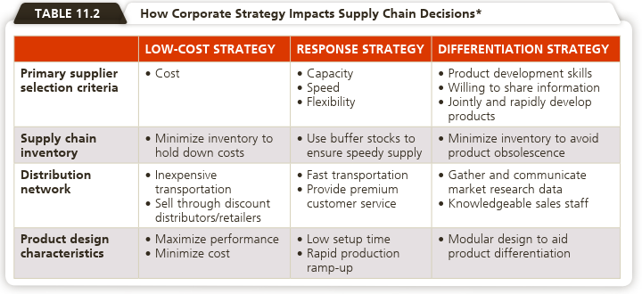
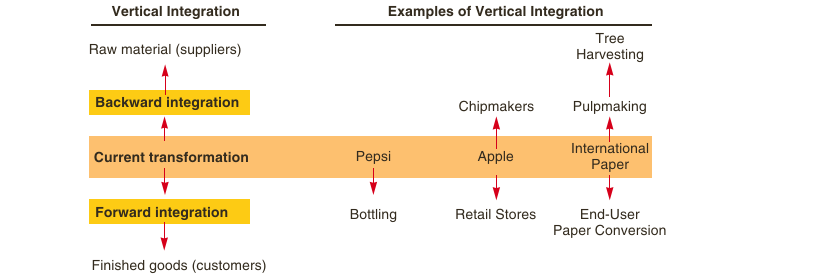
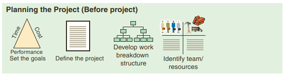
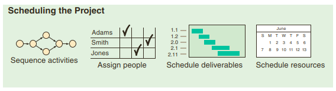
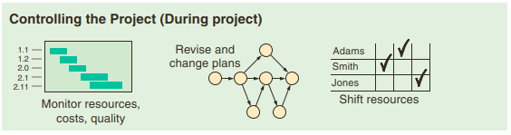

```{r setup, include=FALSE}
knitr::opts_chunk$set(echo = FALSE)
```

## Pendahuluan

Sesi ini akan membahas manajemen rantai pasokan (modul 8) dan manajemen proyek (modul 9).

Secara umum setelah mempelajari modul 8, mahasiswa diharapkan dapat menjelaskan manajemen rantai pasokan dan sistem produksi ramping.

Secara khusus, setelah mempelajari modul ini, mahasiswa diharapkan mampu:

1. menjelaskan pengertian manajemen rantai pasokan
2. menjelaskan strategi perusahaan dan rantai pasokan
3. menjelaskan rantai pasokan pada perusahaan jasa atau layanan
4. menjelaskan bagaimana mengelola rantai pasokan
5. menjelaskan strategi rantai pasokan dalam perusahaan
6. menjelaskan berbagai teknologi informasi yang mendukung rantai pasokan
7. menjelaskan cara mengukur kinerja rantai pasokan
8. menjelaskan pengertian *outsourcing*
9. menjelaskan pentingnya melakukan alih daya
10. menjelaskan perencanaan strategi dan kompetensi inti
11. menjelaskan sistem operasional yang ramping

Dalam modul 9, Anda diajak mendiskusikan perencanaan, penjadwalan dan pengendalian proyek. Secara umum setelah mempelajari modul ini, mahasiswa diharapkan dapat menjelaskan konsep proyek dan manajemen proyek serta alat dan teknik untuk mengelola proyek.

Secara khusus, setelah mempelajari modul ini, mahasiswa diharapkan mampu:

1. menjelaskan pengertian manajemen proyek
2. menjelaskan perencanaan proyek
3. menjelaskan penjadwalan proyek
4. menjelaskan pengendalian proyek
5. menjelaskan PERT/CPM
6. menjelaskan penjadwalan proyek dengan PERT dan CPM

## Modul 8: Manajemen Rantai Pasokan (*Supply Chain Management*)

### KB 1 Manajemen Rantai Pasokan

- Supply chain management describes the coordination of all supply chain activities, starting with raw materials and ending with a satisfied customer. 
  + suppliers; manufacturers and/or service providers; and distributors, wholesalers, and/or retailers who deliver the product and/or service to the final customer.
- The objective of supply chain management is to structure the supply chain to maximize its competitive advantage and benefits to the ultimate consumer.

### Strategi Perusahaan dan Rantai Pasokan


`Sumber: Heizer, et. al. (2020)`

### Strategi Rantai Pasokan

1. Many Suppliers

  - With the many-suppliers strategy, a supplier responds to the demands and specifications of a “request for quotation,” with the order usually going to the low bidder. 
  - This is a common strategy when products are commodities. 
  - This strategy plays one supplier against another and places the burden of meeting the buyer’s demands on the supplier. 
  - Suppliers aggressively compete with one another. 
  - This approach holds the supplier responsible for maintaining the necessary technology, expertise, and forecasting abilities, as well as cost, quality, and delivery competencies. 
  - Long-term “partnering” relationships are not the goal.

2. Few Suppliers

  - A strategy of few suppliers implies that rather than looking for short-term attributes, such as low cost, a buyer is better off forming a long-term relationship with a few dedicated suppliers. 
  - Long-term suppliers are more likely to understand the broad objectives of the procuring firm and the end customer. 
  - Using few suppliers can create value by allowing suppliers to have 
economies of scale and a learning curve that yields both lower transaction costs and lower production costs. 
  - This strategy also encourages those suppliers to provide design innovations 
and technological expertise.

3. Vertical Integration

  - Purchasing can be extended to take the form of vertical integration. 
  - By vertical integration, we mean developing the ability to produce goods or services previously purchased or to actually buy a supplier or a distributor.



4. Joint Ventures

   - Because vertical integration is so dangerous, firms may opt for some form of formal collaboration. 

5. Keiretsu Networks

  - Many large Japanese manufacturers have found another strategy: it is part collaboration, part purchasing from few suppliers, and part vertical integration. 
  - These manufacturers are often financial supporters of suppliers through ownership or loans. 
  - The supplier becomes part of a company coalition known as a keiretsu. 
  - Members of the keiretsu are assured long-term rela-
tionships and are therefore expected to collaborate as partners, providing technical expertise and stable quality production to the manufacturer.

6. Virtual Companies

  - Virtual companies rely on a variety of good, stable supplier relationships to provide services on demand. 
  - Suppliers may provide a variety of services that include doing the payroll, hiring personnel, designing products, providing consulting services, manufacturing components, conducting tests, or distributing products. 
  - The relationships may be short- or long-term and may 
include true partners, collaborators, or simply able suppliers and subcontractors. Whatever the formal relationship, the result can be exceptionally lean performance. 
  - The advantages of virtual companies include specialized management expertise, low capital investment, flexibility, and speed. The result is efficiency.

### Mengukur Kinerja Rantai Pasokan

### KB2: Sistem Operasional yang Ramping (*Lean Operation*)

- Lean operations supply the customer with exactly what the customer wants when the customer wants it, without waste, through continuous improvement. 
- Lean operations are driven by workflow initiated by the “pull” of the customer’s order. 
- Just-in-time (JIT) is an approach of continuous and forced problem solving via a focus on throughput and reduced inventory. 
- Operations managers address three issues that are fundamental to operations improvement: eliminate waste, remove variability, and improve throughput. 

**Eliminate Waste**

- Lean producers set their sights on perfection: no bad parts, no inventory, only value-added activities, and no waste.

- Sumber Pemborosan:
  + Overproduction: Producing more than the customer orders or producing early (before it is demanded) is waste.
  + Queues: Idle time, storage, and waiting are wastes (they add no value).
  + Transportation: Moving material between plants or between work centers and handling it more than once is waste.
  + Inventory: Unnecessary raw material, work-in-process (WIP), finished goods, and excess operating supplies add no value and are wastes.
  +	Motion: Movement of equipment or people that adds no value is waste.
  +	Overprocessing: Work performed on the product that adds no value is waste.
  +	Defective product: Returns, warranty claims, rework, and scrap are wastes.

### 5S- a Lean production checklist

- Sort: Keep what is needed and remove everything else from the work area; when 
in doubt, throw it out. Identify nonvalue items and remove them. Getting rid of unneeded items makes space available and usually improves workflow.
- Simplify: Arrange and use methods analysis tools to improve workflow and reduce wasted motion. Consider long-run and short-run ergonomic issues. Label and display for easy use only what is needed in the immediate work area. 
- Shine: Clean daily; eliminate all forms of dirt, contamination, and clutter from the work area.
- Standardize: Remove variations from the process by developing standard operating procedures and check-lists; good standards make the abnormal obvious. Standardize equipment and tooling so that cross-training time and cost are reduced. Train and retrain the work team so that when deviations occur, they are readily apparent to all.
- Sustain: Review periodically to recognize efforts and to motivate to sustain 
progress. Use visuals wherever possible to communicate and sustain progress.


## Modul 9: Manajemen Proyek

Setelah mempelajari modul ini, secara umum mahasiswa diharapkan dapat menjelaskan konsep proyek dan manajemen proyek serta alat dan teknik untuk mengelola proyek.

Secara khusus, mahasiswa diharapkan mampu:

1. menjelaskan pengertian manajemen proyek
2. menjelaskan perencanaan proyek
3. menjelaskan penjadwalan proyek
4. menjelaskan pengendalian proyek
5. menjelaskan PERT/CPM
6. menjelaskan penjadwalan proyek dengan PERT dan CPM

### KB 1 Manajemen Proyek

- Proyek adalah kegiatan unik dan temporer yang terjadi pada suatu waktu tertentu pada jangka waktu terbatas.

- Manajemen proyek adalah kegiatan merencanakan, mengorganisasikan, mengelola, memimpin serta mengevaluasi proyek yang berjangka waktu tertentu dan untuk memenuhi tujuan tertentu.
- Scheduling projects can be a difficult challenge for operations managers. 
- The stakes in project management are high. 
- Cost overruns and unnecessary delays occur due to poor scheduling and poor controls.
- The management of projects involves three phases:
   1. Planning: This phase includes goal setting, defining the project, and team organization.
   2. Scheduling: This phase relates people, money, and supplies to specific activities and relates activities to each other.
   3. Controlling: Here the firm monitors resources, costs, quality, and budgets. It also revises or changes plans and shifts resources to meet time and cost demands.


<br />


<br />


`Sumber: Heizer, et.al. (2020)`

<br />


- Three popular techniques to allow managers to plan, schedule, and control—Gantt charts, PERT, and CPM
- Whatever the approach taken by a project manager, project scheduling serves 
several purposes:

  1. It shows the relationship of each activity to others and to the whole project.
  2. It identifies the precedence relationships among activities.
  3. It encourages the setting of realistic time and cost estimates for each activity.
  4. It helps make better use of people, money, and material resources by identifying critical bottlenecks in the project.

#### Gantt charts 

- Gantt charts are low-cost means of helping managers make sure that (1) activities are planned, (2) order of performance is documented, (3) activity time estimates are recorded, and (4) overall project time is developed.
- Easy to understand


`Sumber: Heizer, et.al. (2020)`

#### Project Management Techniques: PERT and CPM

PERT and CPM both follow six basic steps:

  1. Define the project and prepare the work breakdown structure.
  2. Develop the relationships among the activities. Decide which activities must precede and which must follow others.
  3. Draw the network connecting all the activities.
  4. Assign time and/or cost estimates to each activity.
  5. Compute the longest time path through the network. This is called the critical path.
  6. Use the network to help plan, schedule, monitor, and control the project.

PERT and CPM are important because they can help answer questions such as the follow-
ing about projects with thousands of activities:

  1. When will the entire project be completed?
  2. What are the critical activities or tasks in the project—that is, which activities will delay the entire project if they are late?
  3. Which are the noncritical activities—the ones that can run late without delaying the whole project’s completion?
  4. What is the probability that the project will be completed by a specific date?
  5. At any particular date, is the project on schedule, behind schedule, or ahead of schedule?
  6. On any given date, is the money spent equal to, less than, or greater than the budgeted 
amount?
  7. Are there enough resources available to finish the project on time?
  8. If the project is to be finished in a shorter amount of time, what is the best way to accomplish this goal at the least cost?
  
--> Lihat contoh dan latihan di BMP


