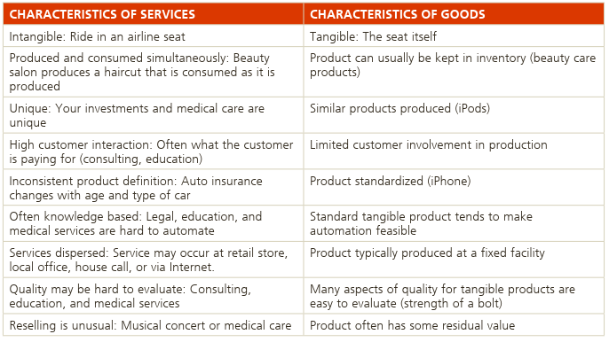

### Capaian Pembelajaran

Secara Umum, setelah mempelajari Modul ini mahasiswa diharapkan dapat menjelaskan manajemen operasional dan strategi operasional. Secara khusus, setelah mempelajari Modul ini mahasiswa diharapkan mampu:

1. menjelaskan pengertian manajemen operasional
2. menjelaskan fungsi-fungsi operasional
3. menjelaskan perbedaan antara produk dan jasa
4. menjelaskan sejarah perkembangan manajemen operasional
5. menjelaskan tren atau perkembangan dalam manajemen operasional,
6. menjelaskan keputusan yang diambil oleh manajer operasional,
7. menjelaskan pengertian strategi operasional
8. menjelaskan strategi operasional dan kegiatan operasional
9. menjelaskan penyusunan strategi operasional
10. menjelaskan cara mencapai keunggulan bersaing melalui strategi operasional
11. menjelaskan pengembangan dan implementasi strategi operasional.

## KEGIATAN BELAJAR 1

### A. Pengertian Manajemen Operasional

- Setiap organisasi agar tetap *exist* harus menciptakan nilai dalam bentuk solusi, produk dan jasa untuk pelanggan. Caranya adalah mentransformasi sumberdaya yang dimiliki menjadi solusi yang dipakai oleh pelanggan.
- **Operasional** proses transformasi input menjadi output dengan tambahan nilai (*value-added*).
- **Manajemen Operasional**: seperangkat kegiatan menciptakan nilai produk atau jasa yang dihasilkan melalui proses transformasi input menjadi output.
- **Manajer Operasional**: mengawasi proses transformasi tersebut, melakukan perencanaan dan desain sistem operasional, serta mengelola kebutuhan material, kualitas dan produktivitas.

```
Operations management is about how organizations create and
deliver services and products.
```

**PERHATIKAN** ilustrasi berikut:

- Everything you wear, sit on, use, or read in the Mosque during Tarawih comes to you courtesy of the operations managers who organized its creation and delivery.
- Every lecture you attend at university, every book you borrow from the library, every treatment you receive at the hospital, every meal you receive at your chosen cafe, every service you expect in the shops – all have been created by operations managers. 
- Orang yang mengawasi penciptaan dan pendistribusian barang dan jasa disebut 'manajer operasi', walaupun mereka tidak selalu disebut demikian.
- Makul ini berkaitan dengan tugas, permasalahan dan keputusan manajer operasi yang membuat barang dan jasa yang dibutuhkan oleh pelanggan. 

---

### Proses Transformasi Input-Output

```{r out.width= "120%", echo=FALSE}

```
`Sumber: Nigel Slack and Alistair Brandon-Jones (2019)`

**Input untuk Proses**

- Materials:
  - mengubah ciri fisik (*physical properties*) seperti bentuk atau komposisi.
  - mengubah lokasi (*location*) seperti parcel delivery. 
  - mentransfer kepemilikan (*to change the possession*).
  - menyimpan material (*store materials*) seperti warehouses.
- Information
  - process information could transform their informational properties (that is, the purpose or form of the information) seperti accountants do this. 
  - Some change the possession of the information: for example, market research companies sell information. 
  - Some store the information, such as archives and libraries. 
  - Some operations, such as telecommunication companies, change the location of the information.

- Pelanggan/(*Customers*)

  - operations which process customers might change their physical properties in a similar way to materials processors: for example, hairdressers or cosmetic surgeons.
  - Some store (or more politely accommodate) customers: hotels, for example. 
  - Air-lines, mass rapid transport systems and bus companies transform the location of their customers, while hospitals transform their physiological state. 
  - Some are concerned with transforming their psychological state: for example, 
most entertainment services such as music, theatre, television, radio and theme parks.

--> Khusus Pelanggan

  - they are not always simple ‘passive’ items to be processed. They can also play a more active part in many operations and processes. For example, they create the atmosphere in a restaurant; they provide the stimulating environment in learning groups in education, they provide information at check-in desks, and so on. 
  - When customers play this role, it is usually referred to as ‘co-production’ because the customer plays a vital part in the provision of the product/service offering.

```{r out.width= "120%", echo=FALSE}
knitr::include_graphics("input-dominan-transformasi.png")
```
`Sumber: Nigel Slack and Alistair Brandon-Jones (2019)`

**Keluaran dari Proses (outputs from the process)**

- Operations create products and services. Products and services are different.
- Products are usually tangible things whereas services are activities or processes. 
- A car or a newspaper or a restaurant meal is a product, whereas a service is the activity of the customer using or consuming that product. 
- Some services do not involve products. Consultancy advice or a haircut is a process (although some products may be supplied in support of the service, such as a report or a hair gel). 
- Also, while most products can be stored, at least for a short time, service only happens when it is consumed or used. So, accommodation in an hotel room for example will perish if it is not sold that night, a restaurant table will remain empty unless someone uses it that evening.


---

### Nilai Tambah (*value-added*)

- Esensi dari fungsi operasi adalah menciptakan nilai tambah dalam proses transformasi.
- Nilai tambah (*value-added*) adalah perbedaan antara biaya masukan/input dengan nilai atau harga dari keluaran/output.
- Di dalam organisasi non profit, nilai dari outputnya (misalnya polisi, TNI, pemadam kebakaran) adalah nilai mereka pada masyarakat (keamanan, kenyamanan, dll); semakin besar nilai tambah yang diberikan, artinya semakin efektif operasi mereka. 
- Di dalam organisasi dengan tujuan profit, nilai dari output diukur dari harga yang ingin dibayar oleh pelanggan untuk barang atau jasa mereka.  
- Perusahaan menggunakan uang untuk yang diperoleh dari nilai tambah untuk kegiatan R&D, investasi fasilitas dan peralatan baru, gaji karyawan dan keuntungan.
- Semakin besar nilai tambah semakin banyak dana yang tersedia untuk kegiatan ini.
- Nilai juga bisa dalam bentuk psikologis seperti branding. 

```{r out.width= "120%", echo=FALSE}

```
`Sumber: Stevenson, William J. (2021)`

---

### PERBEDAAN PRODUK DAN JASA

```{r out.width= "120%", echo=FALSE}

```
`Sumber: Jay Heizer, Barry Render, and Chuck Munson (2020)`

---

### Prinsip Operasi

Hampir semua operasi menghasilkan barang dan jasa, dan

```
Perbedaan antara operasi yang menghasilkan produk atau jasa 
semakin tidak relevan. Pada dasarnya semua operasi 
menghasilkan layanan bagi pelanggannya. 
```

---

## KEGIATAN BELAJAR 2: Strategi Operasional

### Pengertian Strategi

An effective operations management effort must have a **mission** so it knows *where it is going* and a **strategy** so it knows *how to get there*.

**Misi**: the purpose or rationale for an organization’s existence

**Strategi**: suatu langkah untuk menyusun rencana kegiatan yang dilakukan secara sengaja yang dapat menciptakan dan menyusun keunggulan bersaing.

### Mencapai Keunggulan Bersaing melalui Strategi Operasional

Keunggulan bersaing adalah penciptaan suatu sistem yang memiliki keunggulan khas dibanding para pesaing. Tujuannya adalah menciptakan nilai bagi pelanggan secara efisien dan berkelanjutan.

- manajer operasi yang akan diminta mengimplementasikannya.

---

### Memahami Lingkungan Bisnis: Porter’s five forces model

```{r out.width="110%", echo=FALSE}

```

- Buyer power is high when customers have many choices and low when they have few choices. Typically, organizations try to limit buyers’ choices by offering services that make it difficult for customers to switch, which is essentially using a differentiation strategy.
- Supplier power is high when customers have fewer options and low when customers have more options. 
- The threat of customers choosing substitute products or services is high when many alternatives to an organization’s products and services are available. 
- The threat of new entrants into the market-place is low when duplicating a company’s product or service is difficult. Organizations often use focus strategies to ensure that this threat remains low. 
  - Sampai saat ini, mesin pencari Google sangat sulit ditandingi oleh mesin pencari lain. 

---

### Tiga Strategi Bersaing
  
**1. Perbedaan (differentiation)**

- Differentiation is concerned with providing uniqueness: desain, purna jual, pengalaman.
- Distinguishing the offerings of an organization in a way that the customer perceives as adding value.
- Differentiation should be thought of as going beyond both physical characteristics and service attributes to encompass everything about the product or service that influences the value that the customers derive from it.

**2. Biaya rendah (Low-cost leadership)**

- Entails achieving maximum value as defined by your customer melalui:
  - a facility that is effectively utilized, biaya overhead yang rendah, manajemen persediaan

**3. Cepat Tanggap (quick response)**

- A set of values related to rapid, flexible, and reliable performance.
  - Flexible response is the ability to match changes in a marketplace where design innovations and volumes fluctuate substantially.
  - The reliability of scheduling.
  - Quickness