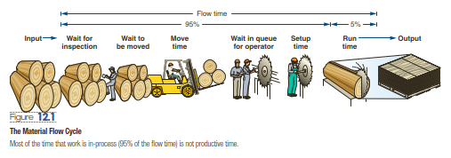
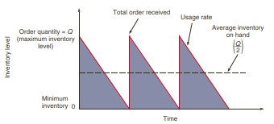
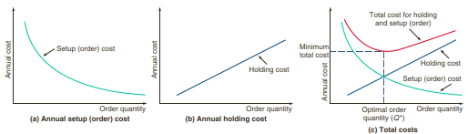

```{r load_packages, echo=FALSE}
library('fontawesome')
```

## `r fa("readme")` PENDAHULUAN

Tujuan pengelolaan persediaan adalah memenuhi permintaan pelanggan dan mencapai keefektifan biaya. Modul ini membahas permasalahan manajemen persediaan tradisional dan mendiskusikan beberapa model yang lebih populer untuk membuat keputusan persediaan yang efektif dalam biaya.

Secara umum, setelah mempelajari modul ini, mahasiswa diharapkan dapat menjelaskan manajemen model persediaan independen dan manajemen model persediaan dependen. Secara khusus, Anda diharapkan mampu:

- `r emo::ji('check')` menjelaskan pengertian dan manfaat persediaan dalam perusahaan manufaktur dan layanan
- `r emo::ji('check')` menjelaskan model-model persediaan dengan permintaan independen.
- `r emo::ji('check')` menjelaskan pengertian persediaan dependen.
- `r emo::ji('check')` menjelaskan pengertian dan manfaat rencana kebutuhan material.
- `r emo::ji('check')` menjelaskan teknik-teknik dalam menyusun rencana kebutuhan bahan/material.
- `r emo::ji('check')` menjelaskan sistem persediaan *just-in-time*.
- `r emo::ji('check')` menjelaskan perencanaan sumber daya perusahaan jasa.

<br />


## `r emo::ji('books')` KEGIATAN BELAJAR 1: Model Persediaan Independen

### A. PENGERTIAN PERSEDIAAN

- Inventory is present in all service and manufacturing processes. 
- In manufacturing, inventory consists of the components that make up the product
being manufactured.
- In services, inventory may be used as part of the service delivery system (for example, disposable implements for a hospital operation), or it may be part of the tangible component of the service itself (for example, the brochure for a car insurance policy). 
- A bank has methods to control its inventory of cash. 
- A hospital has methods to control blood supplies and pharmaceuticals. 
- Government agencies, schools, and, of course, virtually every manufacturing and production organization are concerned with inventory planning and control.
- *Inventory is important because although it is necessary for customer service it can also be a major cost to the organization*.

`Persediaan adalah segala sesuatu yang disimpan untuk digunakan jika diperlukan`

#### Fungsi Persediaan

1. To provide a selection of goods for anticipated customer demand and to separate the firm
from fluctuations in that demand. Such inventories are typical in retail establishments.
2. To decouple various parts of the production process. For example, if a firm’s supplies fluctuate, extra inventory may be necessary to decouple the production process from suppliers.
3. To take advantage of quantity discounts, because purchases in larger quantities may reduce
the cost of goods or their delivery.
4. To hedge against inflation and upward price changes.

#### Jenis-jenis Persediaan

1. Raw material inventory has been purchased but not processed. 
2. Work-in-process (WIP) inventory is components or raw material that have undergone some
change but are not completed. WIP exists because of the time it takes for a product to be made (called flow time). 
   - Reducing flow time reduces inventory. Often this task is not difficult: during
most of the time a product is “being made,” it is in fact sitting idle. As Figure 12.1 shows, actual work time, or “run” time, is a small portion of the material flow time, perhaps as low as 5%.



`Sumber: Render, et.al. (2020)`

3. MROs are inventories devoted to maintenance/repair/operating supplies necessary to keep machinery and processes productive. They exist because the need and timing for maintenance and repair of some equipment are unknown. 

4. Finished-goods inventory is completed product awaiting shipment. Finished goods may be inventoried because future customer demands are unknown.

### B. MODEL-MODEL PERSEDIAAN

- Inventory control models assume that demand for an item is either independent of or dependent on the demand for other items. 
  + For example, the demand for refrigerators is independent of the demand for toaster ovens. 
  + However, the demand for toaster oven components is dependent on the requirements of toaster ovens.
  
#### 1. Model Kuantitas Pemesanan Ekonomis (Economic Order Quantity/EOQ) 

- The economic order quantity (EOQ) model is one of the most commonly used inventory-control techniques. 
- This technique is relatively easy to use but is based on several assumptions:
  + Demand for an item is known, reasonably constant, and independent of decisions for
other items.
  + Lead time—that is, the time between placement and receipt of the order—is known and
consistent.
  + Receipt of inventory is instantaneous and complete. In other words, the inventory from
an order arrives in one batch at one time.
  + Quantity discounts are not possible.
  + The only variable costs are the cost of setting up or placing an order (setup or ordering cost) and the cost of holding or storing inventory over time (holding or carrying cost).
  + Stockouts (shortages) can be completely avoided if orders are placed at the right time.







`Sumber: Render, et.al. (2020)`

#### 2. Model Diskon Kuantitas

- A quantity discount is simply a reduced price (P) for an item when it is purchased in larger quantities.
- Quantity discounts appear everywhere—you cannot go into a grocery store without seeing
them on nearly every shelf. 
- Researchers have found that most companies either offer or receive quantity discounts for at least some of the products that they sell or purchase.


#### 3. Model Kuantitas Pemesanan Produksi
- An economic order quantity technique applied to production orders.

#### 4. Model Probabilistik

- A statistical model applicable when product demand or any other variable is not known but
can be specified by means of a probability distribution.

#### 5. Model Simulasi

- Duplikasi atau tiruan terhadap karakteristik, fitur dan penampilan sistem yang nyata dengan menggunakan komputer
- dilakukan jika terdapat ketidakpastian dalam permintaan, waktu antara dan waktu pemesanan kembali


<br />

## `r emo::ji('books')` KEGIATAN BELAJAR 2: Model Persediaan Dependen

### A. PENGERTIAAN PERSEDIAAN DEPENDEN

- Persediaan dependen adalah persediaan yang pengadaannya, baik jumlah dan waktu penyediaannya, ditentukan oleh urutan proses atau kebutuhan bahan atau komponen lain.
- Demand for items is dependent when the relationship between the items can be determined.
- Model ini lebih realistis karena dalam praktik pada umumnnya produk tidak terdiri atas satu jenis bahan baku.

#### Dependent Inventory Model Requirements

Effective use of dependent inventory models requires that the operations manager know the
following:

1. Master production schedule (what is to be made and when)
2. Specifications or bill of material (materials and parts required to make the product)
3. Inventory availability (what is in stock)
4. Purchase orders outstanding (what is on order, also called expected receipts)
5. Lead times (how long it takes to get various components)

#### Manfaat Model Persediaan Dependen

1. Mampu menanggapi permintaan pelanggan
2. Menanggapi secara lebih cepat terhadap perubahan pasar
3. Memperbaiki penggunaan fasilitas dan karyawan
4. Mengurangi persediaan


#### Sistem Persediaan *Just-in-Time*

- *Just-in-time* adalah konsep persediaan dengan pemenuhan secara tepat waktu, tepat jumlah dan tepat kualitas.
- JIT merupakan filosofi sekaligus teknik untuk menghilangkan pemborosan
- Tidak hanya berlaku pada persediaan, pada proses atau mutu juga dapat diterapkan.


#### Manfaat Penerapan JIT

1. Persediaan berkurang
2. Perbaikan kualitas
3. Pengurangan biaya
4. Pengurangan ruang yang dibutuhkan
5. Pengurangan *lead time*
6. Peningkatan produktivitas
7. Fleksibilitas lebih besar
8. Hubungan dengan pemasok lebih baik
9. Kegiatan penjadwalan dan pengendalian lebih sederhana
10. Peningkatan kapasitas
11. Pemberdayaan sumber daya manusia lebih baik
12. Variasi produk lebih banyak mengikuti keinginan pelanggan


<br />
<br />

<!-- AddToAny BEGIN -->
<div class="a2a_kit a2a_kit_size_16 a2a_default_style"; data-a2a-url="https://bangtedy.github.io/etan" data-a2a-title="Manajemen Persediaan">
<a class="a2a_button_whatsapp"></a>
<a class="a2a_button_telegram"></a>
<a class="a2a_button_facebook"></a>
<a class="a2a_button_twitter"></a>
</div>
<script async src="https://static.addtoany.com/menu/page.js"></script>
<!-- AddToAny END -->

